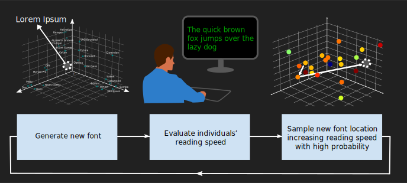

# AdaptiFont

Repository accompanying the publication:
Kadner, F., Keller, Y., & Rothkopf, C. (2021, May). AdaptiFont: Increasing Individuals’ Reading Speed with a Generative Font Model and Bayesian Optimization. In Proceedings of the 2021 CHI Conference on Human Factors in Computing Systems (pp. 1-11).

  <a href="#what-is-provided">What is provided</a>&nbsp;&nbsp;&bull;&nbsp;&nbsp;
  <a href="#best-fonts-per-subject">Truetype fonts</a>&nbsp;&nbsp;&bull;&nbsp;&nbsp;
  <a href="#linux-installation">Linux installation</a>&nbsp;&nbsp;&bull;&nbsp;&nbsp;
  <a href="#morph-your-own-fonts">Morph fonts</a>

<h5 align="center" markdown="1">

  
    
  <b style="font-size:16px;"><i>
  
  The official GitHub repository for the paper on [AdaptiFont: Increasing individuals’ reading speed with a generative fontmodel and Bayesian optimization](https://dl.acm.org/doi/10.1145/3411764.3445140)</i></b>
</h5>

## What is Provided?
This Repositiory supplys additional material for the paper on [AdaptiFont: Increasing individuals’ reading speed with a generative font model and Bayesian optimization](https://dl.acm.org/doi/10.1145/3411764.3445140). Provided are usable fonts in the truetype font (*.ttf*) format  from the centroids of the best clusters for all subjects, as well as a [script](#morph-your-own-fonts) that you can use to combine your own fonts from the NMF components.

## Best fonts per subject
| Subject    | Truetype font | NMF components | How it looks |
| :--------- | :----:    | :--------------------: | :----------: |
| 1     | [subject1.ttf](example_fonts/best_subject_fonts/subject1/subject1.ttf)     | 4.56, 5.32, 5.57 |   |
| 2        | [subject2.ttf](example_fonts/best_subject_fonts/subject2/subject2.ttf)     | 5.5, 1.89, 3.66 |   |
| 3      | [subject3.ttf](example_fonts/best_subject_fonts/subject3/subject3.ttf)     | 4.56, 4.1, 6.41 |   |
| 4   | [subject4.ttf](example_fonts/best_subject_fonts/subject4/subject4.ttf)     | 4.32, 3.76, 5.32 |   |
| 5 | [subject5.ttf](example_fonts/best_subject_fonts/subject5/subject5.ttf)     | 4.39, 2.44, 5.59 |    |
| 6      | [subject6.ttf](example_fonts/best_subject_fonts/subject6/subject6.ttf)     | 5.80, 1.1, 1.86 |    |
| 7     | [subject7.ttf](example_fonts/best_subject_fonts/subject7/subject7.ttf)     | 6.63, 1.59, 2.54 |    |
| 8   | [subject8.ttf](example_fonts/best_subject_fonts/subject8/subject8.ttf)     | 5.37, 3.54, 3.56 |   |
| 9     | [subject9.ttf](example_fonts/best_subject_fonts/subject9/subject9.ttf)      | 4.27, 3.5, 4.15 |    |
| 10      | [subject10.ttf](example_fonts/best_subject_fonts/subject10/subject10.ttf)      | 5.63, 5.38, 1.3 |   |
| 11      | [subject11.ttf](example_fonts/best_subject_fonts/subject11/subject11.ttf)      | 5.7, 3.02, 3.08 |   |

## Linux installation
1. Clone this repository
2. Install python header files `sudo apt install python3.6-dev` (May be called differently based on your python3 version)
3. (Optional) Create a fresh python 3 virtualenv and activate it for example using `sudo apt install virtualenv`, `virtualenv venv --python=python3`, `. venv/bin/activate`. I used 3.6.9, but most python 3 versions should do.
4. Install python dependencies `pip install numpy pillow matplotlib fontTools`
5. Install fontforge from ppa `sudo add-apt-repository ppa:silnrsi/smith-py3` `sudo apt-get update` `sudo apt install python3-fontforge`
6. You may need to install libfontforge-dev `sudo apt install libfontforge-dev`
7. Restart your Terminal and you should be ready to go creating your own fonts.

## Morph your own fonts

There is a tutorial provided on how to create your own fonts in [Creating_Fonts.ipynb](Creating_Fonts.ipynb). For that you will need jupyter and matplotlib `pip install jupyter matplotlib`. You can also start creating fonts directly from terminal using the [create_font.py](font_factory/create_font.py) script. From the repositorys root call for example `python3 font_factory/create_font.py example --nmf_dims 1,5,8 --out_folder example_fonts` to create a font called `example.ttf` in `example_fonts/example` with the NMF component weights of 1,5 and 8 for the 3 dimensions respectively.
